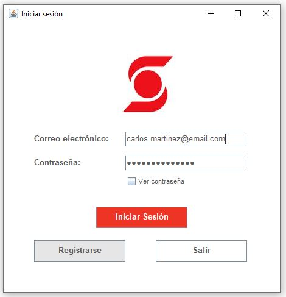
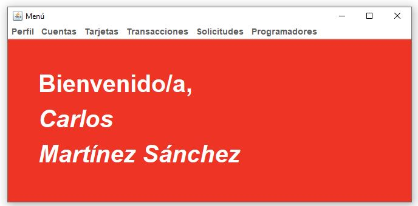
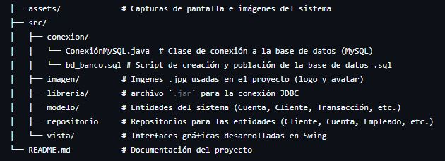
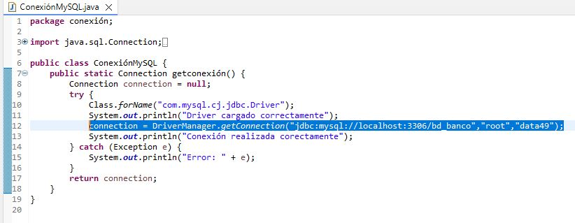

# 🏦 java-banking-system-project

  
  
  

Un sistema de escritorio para la gestión bancaria y transaccional desarrollado bajo el paradigma de **Programación Orientada a Objetos (POO)**. Este software simula el núcleo operativo de una entidad financiera, conectando una interfaz gráfica intuitiva con una base de datos relacional para garantizar la persistencia e integridad de cada operación.

---

## 📸 Vista Previa (Puede encontrar todas las interfacez en "assets")

<table width="100%">
  <tr>
    <td width="50%" align="center">
      <strong>Login de Acceso</strong> 
      
    </td>
    <td width="50%" align="center">
      <strong>Menú principal (Cliente)</strong> 
      
    </td>
  </tr>
</table>

## 🚀 Características Clave

* **Gestión de Clientes y Cuentas:** Registro, consulta y actualización de información bancaria de usuarios.
* **Módulo Transaccional:** Simulación en tiempo real de depósitos, retiros y transferencias entre cuentas con validaciones lógicas estrictas (control de saldos insuficientes, cuentas inexistentes, etc.).
* **Persistencia de Datos:** Conexión robusta a través de **JDBC** hacia una base de datos MySQL relacional.
* **Interfaz de Usuario Interactiva:** Diseñada con **Java Swing** para ofrecer una experiencia limpia, organizada y funcional.

## 📊 Estructura del Proyecto

## 🛠️ Requisitos del Sistema

Para poder ejecutar o modificar este proyecto en tu entorno local, asegúrate de contar con:

* **Java JDK 8 o superior** (Entorno de desarrollo de Java).
* **Eclipse IDE** (o tu entorno de desarrollo preferido compatible con Java desktop).
* **MySQL Server (8.0 o superior)** y **MySQL Workbench** para gestionar la base de datos.
* **MySQL Connector/J** (archivo `.jar` para la conexión JDBC, incluido en el proyecto).

## 📝 Instrucciones de Instalación e Importación

1. Clonar el repositorio: git clone [https://github.com/Kevin-Andr3/java-banking-system-project.git](https://github.com/Kevin-Andr3/java-banking-system-project.git)
2. Configurar la base de datos:
  - Abre MySQL Workbench.
  - Importa y ejecuta el script bd_banco.sql ubicado en la ruta /src/conexion/bd_banco.sql para generar el esquema de tablas y datos iniciales.
3. Importar el proyecto en Eclipse IDE:
  - Abre Eclipse.
  - Ve a File ➡️ Import... ➡️ General ➡️ Existing Projects into Workspace.
  - Selecciona la carpeta raíz del proyecto clonado y haz clic en Finish.
4. Configurar las credenciales de conexión:
  - Abre la clase de conexión a la base de datos (ubicada en el paquete conexion).
  - Actualiza el usuario (root) y contraseña (data49) con las credenciales de tu MySQL local en la línea:
    
  - Nota: Debes abrir el archivo "bd_banco.sql" en tu MySQL.
5. Ejecutar:
  - Haz clic derecho sobre la clase principal con el método main y selecciona Run As ➡️ Java Application.

## 👥 Colaboradores (Equipo de Desarrollo)

Este proyecto fue desarrollado con fines académicos de manera colaborativa por estudiantes de Ingeniería de Sistemas (puede encontrarlos en la ventana "Colaboradores").
Mi contribución estuvo enfocada en el análisis, diseño y desarrollo de distintos módulos de la aplicación. El repositorio se publica como muestra de portafolio con el reconocimiento correspondiente al trabajo en equipo.
